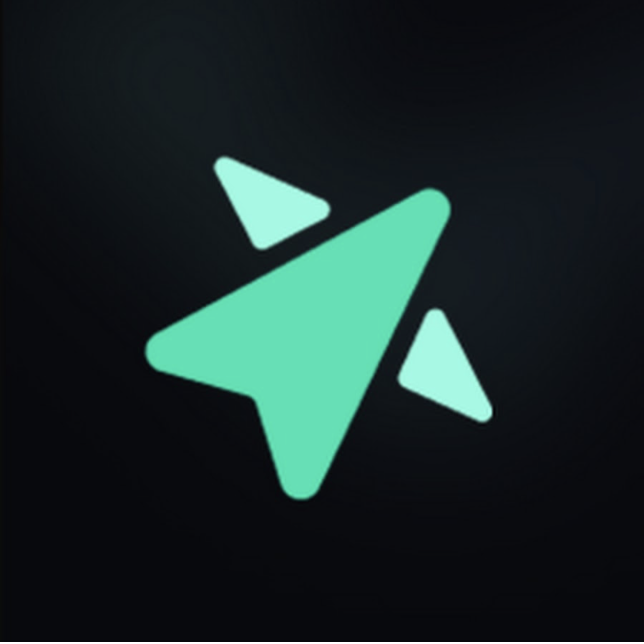
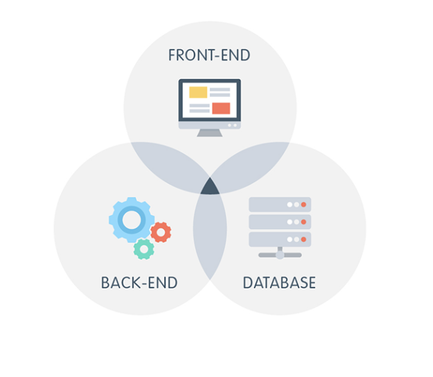

<!DOCTYPE html>
<html lang="en">
<head>
    <meta charset="UTF-8">
    <link rel="stylesheet" href="main.css">
    <link rel="stylesheet" href="https://cdnjs.cloudflare.com/ajax/libs/font-awesome/5.15.4/css/all.min.css">
    <title>Title</title>
</head>

<body>
<section class="sidebar">
    

        <a href="#Sector-1">
            
            Home
        </a>
    

    

        <a href="#Sector-2">
            
            About Me
        </a>
    

    

        <a href="#Sector-3">
            
            Worklife
        </a>
    

    

        <a href="#Sector-4">
            
            Projects/Xperience
        </a>
    

    

        <a href="#about-section">
            
            Contact
        </a>
    

</section>

<section id="Sector-1" class="sections">
    
Aspiring

    

        

 <!-- Typing effect will be applied here -->
    

</section>

<section id="Sector-2" class="sections">
    

        
Innovative

        
Technical Student

        

        

            Constantly becoming acclimated with the latest technologies and methodologies to innovate tech-world solutions.
        

        

            
            
A sweetheart ☺️

        

    

    

        
I am

        
        

            Nick Mack! To start off my tech journey began a very long time ago but not like
            the prevalent notorious stories I heard growing up which was "I've been programming since I was 10-years-old"
            or "getting hands-on with robotics at 7". I grew up far from the hectic world of technology. I loved playing with Legos and
            video games, and occasionally assembling and disassembling arbitrary items i.e. pens, toy cars, etc. I've always had a knack for
            figuring out how things worked which is why my family didn't become surprised as I chose to pursue this route. Especially
            cars, but never really considered pursuing a field that required immense brainpower.

            In addition to growing up, I preferred staying out of the spotlight. Life wasn't particularly hard, but being an outlier in society
            made me a target for occasional bullying, which definitely caused me to get further and further into this rabbit hole kind of.
            I definitely avoided public speaking and leadership roles as those are the biggest two I'm working myself through. Moreover, with that
            occurring, it didn't me but just find more comfort in staying unnoticed. This tendency to avoid uncomfortable situations hindered growth
            and kept me from speaking up.

            As I entered college, I found myself unsure of what major to choose. Soooo, I decided to test the waters with different stem fields and eventually
            stumbling upon a Computer Science class. The moment I saw coding, I was weirdly reminded of building with Legos and noticed how connected I was
            instead of boredom. The only difference was that instead of physical blocks, I was now working with lines of code in an IDE or terminal.
            It was like constructing intricate structures, but in a digital world.

            The more I delved into Computer Science, the more I just genuinely enjoyed it. However, I knew the fun wouldn't last forever. Immersing myself in this
            new environment meant preparing to be uncomfortable, surrounded by incredibly smart individuals and grappling with concepts I never thought I'd encounter.
            These topics were some of the hardest he had ever faced. About a year into my college journey, I met <a id="adri" href="https://www.linkedin.com/in/adrienbaumert/" target="_blank">Adrien Baumert</a>, a significant influence
            on my path. From the first day we met, he noticed my extremely doubtful way of thinking towards myself and helped me reform in the right direction. Adrien encouraged
            me to overcome my self-doubt, dismiss bad assumptions, and avoid dwelling on "what-ifs." One of Adrien's suggestions was for me to get on LinkedIn, as he knew that community would be heart-warming and welcoming to an
            individual of this background. Before this suggestion, I had barely heard of LinkedIn and had no interest in it. Adrien made him realize the importance of networking and connecting with others, both inside and outside the industry, for incredible
            opportunities and growth. I began to understand the value of stepping out of a comfort zone, realizing that being in uncomfortable situations, not always being the smartest one in the room, struggling with difficult concepts, and dealing with failure
            were all part of the journey, and soon enough I've learned to embrace these challenges instead of embarrassing them.

        

        

            
Scroll Up

            

            
Scroll Down

        

    

</section>

<section id="Sector-3" class="sections">
    

        <h2>Worklife</h2>
    

    

        

            
            

            

                
                <h2>Headstarter AI - SWE Fellow</h2>
                
<strong>Remote - Long Island City, NY, United States - July 2024 - September 2024</strong>

                <!--
As a Software Engineering fellow @ Headstarter AI, over 5 weeks (July 2024 - Sept 2024), I will be working on five AI related projects, aiming to scale up to great depths with my final project which is taking a small startup's current background and build it using biz requirements. This SWE opportunity enhanced my vision and potential, my very own personal brand, various interview prep skills, and importance of network and collaboration.
-->
                
During the first two weeks, I focused on a solo project, where fellows created a personal website. Then soon enough our team decided to gather and collaboratively develop a Pantry Tracker application. For these projects, I utilized HTML, CSS, ReactJS, and Next.js.
                    In the subsequent weeks we gained very rigorous tasks. However, leading into these upcoming weeks with a lovely teammate <a id="hsai-team"href="https://www.linkedin.com/in/sadiatijjani/" target="_blank">Sadia Tijjani</a>, we couldn't wait to lean and embrace the SWE journey together. We developed an AI Customer Support system and integrated it with OpenAI, Next.js, and AWS. This was followed by the AI Flashcards & Stripe project, where I worked on integrating OpenAI, Auth, and StripeAPI functionalities.
                    Later, I contributed to an imitation of Rate My Professor utilizing AI, particularly involved using Retrieval-Augmented Generation (RAG), OpenAI, and vector-based technologies.
                    In the final phase, we focused on the project Track B, which was concentrating on branding, meeting deadlines, and enhancing the user interface of a small startups biz requirements. We culminated the experience by presenting our work to an Software engineer, effectively communicating our project outcomes and goals.

            

        

        

            
            

            

                <h2>Resilience Inc - AI Software Engineer Intern</h2>
                
<strong>Remote - Tampa, Florida, USA - June 2024 - Present</strong>

                
Enhancing software and intergrating AI, ML, and NLP into my work. Developing new user-facing
                    features using Firebase and addressing bug fixes, and efficiently building reusable code for great
                    scalability and maintainability. Continuosly becoming more acclimated authentication and user management
                    systems to improve security and user experience, as well as ensuring secure data storage on both
                    client-side devices and servers. Working alongside senior software engineer solving problems and collaborating
                    with other <a id="resinc"href="https://www.linkedin.com/company/selprograms/mycompany/" target="_blank">Resilience Inc</a> divisions.
                

            

        

        

            
            

            

                <h2>Web Developer - Freelancer</h2>
                
<strong>Remote - Maryland, USA - May 2024 - Present</strong>

                
Worked with various clients to create and enhance their online presence through custom website development.
                    Engaged in tasks ranging from addressing bug fixes to building fully functional websites from scratch.
                    Focused on delivering responsive designs and interactive features to enhance user engagement and satisfaction.
                    Demonstrated expertise in front-end technologies and contributed to the overall success of web projects by ensuring
                    high-quality, user-centric solutions.
                

            

        

        

            
            

            

                <h2>AI4All Nonprofit Inc - Program Participant </h2>
                
<strong>Remote - Catonsville, Maryland, USA - August 2023 - December 2023</strong>

                
Met weekly with the program director covering various techniques and learning the functionality
                    of Artificial Intelligence/Machine Learning. Worked in a group of 2 members creating a python
                    script that takes a dataset of 700+ flower species and constructed a model using supervised learning
                    and machine learning to accurately predict and classify, and implemented text-to-speech to read aloud
                    the rendered decisions.
                

            

        

        

            
            

            

                <h2>Apple Hardware Technician - Freelancer</h2>
                
<strong>Maryland, USA - Sep 2018 - Apr 2020</strong>

                
Promoted and provided repair services for Laptop and iPhones. Fixing common problems both hardware and software.
                    Ensuring high-quality workmanship, communication, and customer satisfaction. Entry-knowledgeable
                    in Apple hardware and software troubleshooting.

            

        

    

</section>

<section id="Sector-4" class="sections">
    

        <h1 id="h1-pro">Projects</h1>
        

    

    

        Click Us
        ↓
    

    

        <h1 id="h1-xp">Experience</h1>
        

            <h2>Beginner</h2>
            

                
Node.js

                
React.js

                
JavaScript

                
C++

                
Databases

                
Backend Development

                
APIs

                
Tensorflow

                
Matplotlib

                
Seaborn

                
AWS

                
HuggingFace AI

                
DSA

                
Calculus II

                
OOP

                
SQL

                
Zenmap

                
Tailwind CSS

                
Text-To-Speech

                
Wireshark

                
Linear Algebra

            

        

        <!--

-->
        

            <h2>Intermediate</h2>
            

                
Python

                
Calculus I

                
JupyterNotebook

                
Microsoft 365

                
Front-End Development

                
Pandas

                
Numpy

                
OpenCV

            

        

        <!--

-->
        

            <h2>Advanced</h2>
            

                
Not yet...maybe one day!

            

        

    

</section>

<footer class="footer">
    

        

            <h2>About</h2>
            
Peaceful Programmer attempting to merge the vastness of the
                galaxy with the intricacies of technology. Individuals like myself have a mission
                to foster innovation and creativity through advanced projects like image classification,
                intrusion detection, and ASL translation is just a start of astonishing excellence.
                Tech-savvy scientists aim to inspire, innovate, and educate each other into the ever-evolving world of tech.
                Join us on this journey as we explore the universe of programming, one innovative mission
                at a time.
            

        

        

            <h2>Follow @'s</h2>
            

                <a href="#"><i class="fab fa-tiktok"></i></a>
                <a href="#"><i class="fab fa-instagram"></i></a>
                <a href="#"><i class="fab fa-discord"></i></a>
                <a href="#"><i class="fab fa-github"></i></a>
                <a href="https://www.linkedin.com/in/nicholasmack972/" target="_blank"><i class="fab fa-linkedin-in"></i></a>
                
            

        

    

    

        
&copy; 2024 - <strong>Nicholas Mack Website</strong> - All Rights Reserved.

    

</footer>

</body>
</html>
